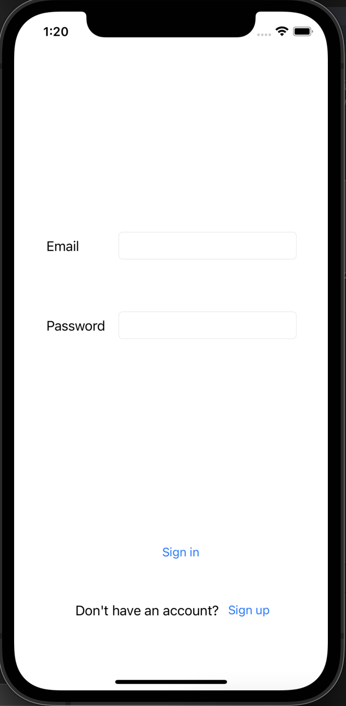
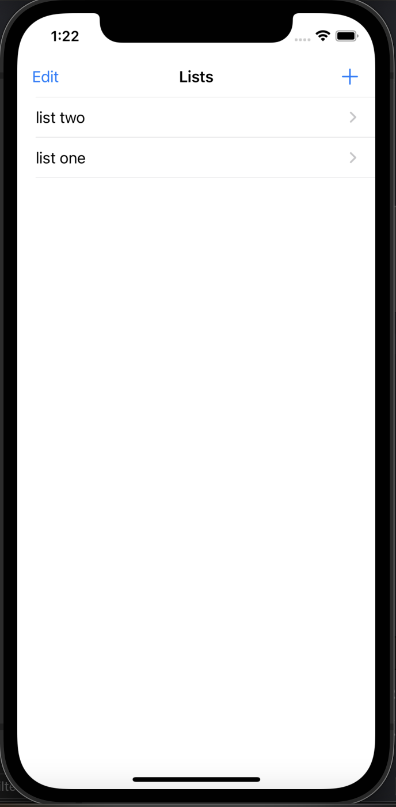
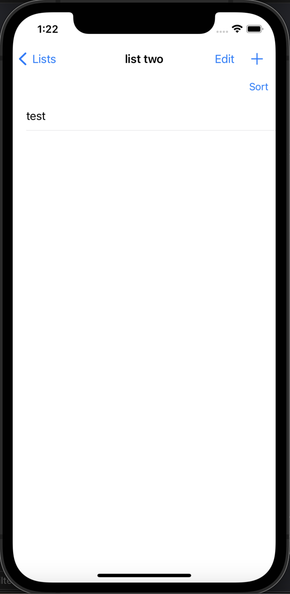

## Todo App

<div>
  
  
  
</div>

This is an iOS todo app with Firebase as a backend. This is used in conjunction with another [React web app](https://github.com/muhdmirzamz/TodoAppReact) I'm working on. Both of these projects connect to the same Firebase database.


### Features

**General:**
- User login screen
- User sign up screen
- You can sign up as a user

**Lists:**
- You can retrieve lists
- You can delete a list
- You can add lists

**Todos**
- You can create todos
- You can sort todos according to timestamp now


### Technologies used
- Swift
- Firebase
- Cocoapods

### INSTALL
Be sure to run ```pod install``` before anything else.
